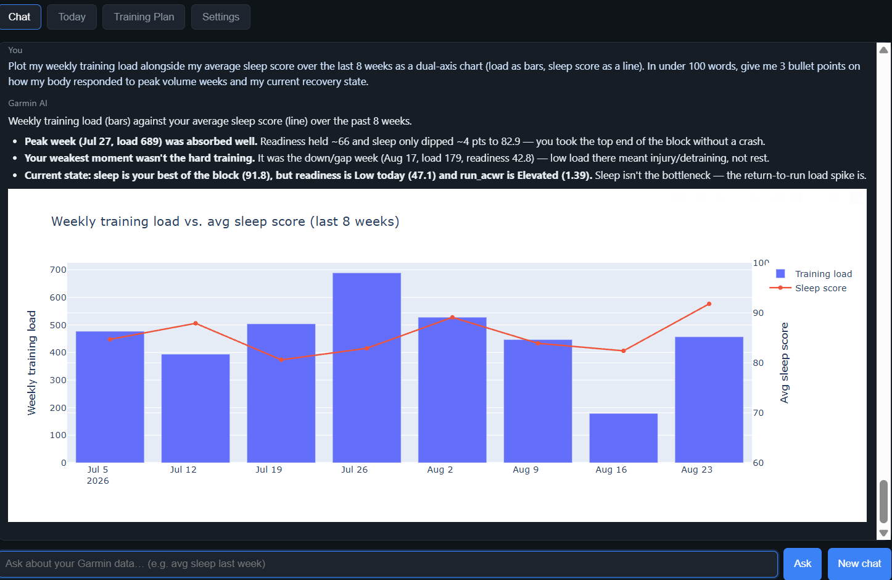
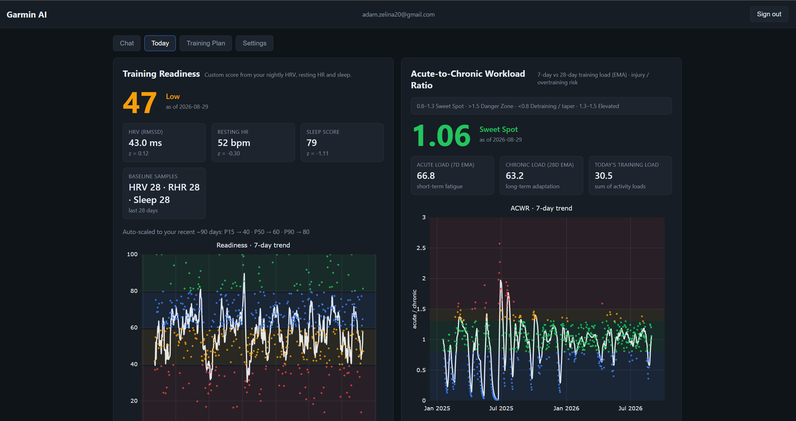
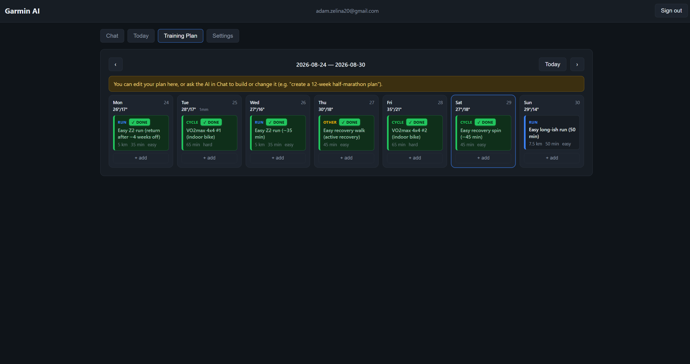

# Garmin Health-Data Agent

> **Ask questions about your Garmin data in plain English — sleep, resting HR,
> HRV, training load, form drift, readiness and ACWR — and get answers with
> charts, weather context and a plan you and the AI can both edit.**

A self-hosted, multi-user Garmin Connect fetcher that syncs your watch into
Postgres and gives you a read-only AI agent that can *see* and quietly reason
about it. The UI and the agent read the **same** derived metrics, so the charts
you look at and the answers the model gives you always agree.

```
Garmin Connect ──▶ sync worker ──▶ Postgres (raw JSON, source of truth) ──▶ parser ──▶ typed tables
                                       ▲  (user_id + RLS on every row)        │
    JS frontend ─▶ FastAPI (JWT) ──▶ garmin-ask agent (read-only role) ◀──────┘
                                           │
                                     derived_metrics (readiness, ACWR)
```

## What it looks like

### Ask the agent anything about your training

The agent does the analysis and hands back a chart with the reasoning:



### Clarity at a glance

Readiness and ACWR are computed for you, with color-coded zones and history:



### A plan you and the AI both own

Build or edit a weekly schedule, and ask the AI to reshape it:



## The audio-mind: a read-only AI agent that can *see*

This is the cool part. The agent isn't just a text-answering chatbot over your
data — it has a **vision loop**. Its `see` tool queries the database, renders
the result as an image, and *looks at the actual shape* of your data (trends,
drift, spikes, clusters, relationships between metrics) before answering. So it
doesn't just fetch a number; it understands it.

That unlocks genuinely sports-science-grade analysis:

- **Lagged correlation.** It can test how last night's sleep or HRV predicts
  today's performance, or how a metric on day *N* relates to day *N+1*.
- **Bonk / crash root-cause analysis.** When your power or pace falls apart
  mid-session, it looks across sleep, HRV, resting HR, prior-day load and even
  the weather at the time of the run to explain _why_ you blew up — not just
  _that_ you blew up.
- **Form drift.** A pace-normalised cadence z-score (`run_cadence_drift`)
  surfaces overstriding / breaking mechanics under fatigue, separately from raw
  volume.
- **Running-isolated ACWR.** `run_acwr` is built from running distance only, so
  cycling and swimming can't mask a running-volume spike.
- **Weather in context.** It correlates a bad night with the temperature, or
  forecasts the next 16 days against your plan — always via stored data first.

Every question is answered by the model writing its own read-only SQL through
`run_sql`; the `see` tool is for *its own eyes*, while `chart` hands the UI a
spec it re-runs to draw. Safety is by construction inside the database layer (see
[Security](#security)).

## What it does

**Sync & store**
- Connects to Garmin Connect per account (credentials encrypted AES-GCM, MFA
  handled as an extra code step, background sync on a bounded worker pool).
- Stores raw JSON as the source of truth, then auto-creates typed tables.

**Multi-user server**
- Email + password login (JWT), each account scoped to its own rows by
  PostgreSQL Row-Level Security.
- `POST /sync` (per-user) plus a cron endpoint to sync every active account.

**Web dashboard**
- Chat · Readiness · ACWR · Training Plan · Settings — a same-origin JS frontend.

**Custom derived metrics** *(computed once per sync, shared by UI and agent)*
- **Readiness (0–100)** — z-score composite of nightly HRV, resting HR and sleep
  score vs. a 28-day baseline, auto-scaled to a rolling 90-day context.
- **ACWR** — `EMA₇(daily load) / EMA₂₈(daily load)`, with Sweet Spot / Elevated /
  Danger / Detraining bands.
- **Running ACWR + gait drift** — running-isolated workload and pace-normalised
  cadence form tracking.

**Read-only AI agent**
- Pydantic AI agent confined by a SELECT-only PG role + a statement gate
  (SELECT/WITH/EXPLAIN). Never writes.
- Tool-calling: schema inspection, `run_sql`, chart specs, `see` (self-image),
  weather, long-term memory, and training-plan read/write.

**Operation hardening**
- Exponential per-account backoff against Garmin's informal API and ban risk;
  tokens auto-refresh and re-encrypt; signup verifies credentials with a real
  Garmin login.

## Data model

Every data table is keyed by `(user_id, …)` and RLS-scoped. `users` is the
separate identity table (email, password hash, encrypted Garmin creds/tokens,
sync status).

| Table | Purpose |
| --- | --- |
| `users` | Accounts: email + bcrypt hash + encrypted Garmin credentials/tokens, active/confirmed, sync status + backoff |
| `metrics` | Raw Garmin JSON payloads, keyed by `(user_id, data_type, calendar_date)` — the single source of truth |
| `daily_metrics` | Parsed daily projection, one wide row per date; columns auto-created on demand |
| `activities` | Raw activity summaries + intra-activity detail/weather/splits payloads, keyed by `(user_id, activityId)` |
| `activity_summaries` | Parsed activity projection (durations, HR, zones, elevation, power, cadence, weather) |
| `activity_detail_series` | Parsed intra-activity time series (HR / cadence / power / speed / elevation / GPS per tick) |
| `activity_splits` | Parsed per-lap splits (work/rest chunks: distance, duration, pace, HR, power, cadence) |
| `hr_zones` | Derived per-sport heart-rate zone ranges from the device profile |
| `power_zones` | Derived per-sport power-zone ranges (watts) + functional threshold power |
| `race_predictions` | Current race-prediction snapshot (5k/10k/half/full finish times) |
| `user_profile` | Raw profile snapshots (HR zones, power zones, race predictions, gear, devices) |
| `gear` | Current gear snapshot (bikes, shoes, ...) with cumulative stats — replaced each sync, no history |
| `devices` | Current Garmin devices (model + which is primary) — replaced each sync, no history |
| `derived_metrics` | Computed daily metrics — one row per `(calendar_date, metric)`; `readiness` (+ `readiness_*` components) and `acwr` (+ acute/chronic/daily load). Replaced wholesale each sync |
| `weather_forecast` | Stored daily Open-Meteo forecast (min/max °C, precip mm, max wind), refreshed once per sync — the Training Plan calendar renders it from here, RLS-scoped per account |
| `training_plan` | Per-user planned workouts (editable in the UI and by the agent) |
| `user_state` | Per-user agent state: long-term memory, conversation history, tool-call trace |

## Setup

Requirements: **Python 3.14+** (required — the project targets 3.14 and enforces
it via `requires-python` in `pyproject.toml`), [`uv`](https://docs.astral.sh/uv/)
and Docker.

```sh
git clone https://github.com/adamzelina1/garmin-agent-web.git
cd garmin-agent-web
uv sync

# 1. Start Postgres + server (roles garmin_app / garmin_readonly are
#    bootstrapped on a fresh volume by docker/initdb/01-roles.sh)
docker compose up -d

# 2. Configure secrets in .env (see .env.example): GARMIN_ENC_KEY,
#    GARMIN_JWT_SECRET, GARMIN_CRON_TOKEN and the three DSNs.
cp .env.example .env
```

For an already-running database, create the roles once (as superuser):

```sh
uv run python -c "from garmin_fetch.server.setup_db import ensure_roles; import os
ensure_roles(os.environ['GARMIN_ADMIN_DB_URL'], os.environ['GARMIN_DB_URL'], os.environ['GARMIN_READONLY_DB_URL'])"
```

## Usage

```sh
uv run garmin-server --port 8000        # open http://127.0.0.1:8000
```

The page handles register/login (a single-step Garmin bind: signup logs into
Garmin once to verify the credentials — MFA, wrong password, or a
rate-limit/Cloudflare block all fail signup with a clear message), a
"Sync now" button with status, a chat box that renders charts, and the
derived-metric tabs. Readiness and ACWR are recomputed automatically on every
sync once enough data has landed, so the tabs need no manual refresh beyond a
sync. Every request carries the JWT; the agent only ever sees the
authenticated user's rows.

Direct API examples:

```sh
TOKEN=$(curl -s -X POST http://127.0.0.1:8000/auth/login \
  -H 'Content-Type: application/json' \
  -d '{"email":"you@example.com","password":"password123"}' | python -c 'import sys,json;print(json.load(sys.stdin)["token"])')

curl -s -X POST http://127.0.0.1:8000/sync -H "Authorization: Bearer $TOKEN"
curl -s http://127.0.0.1:8000/readiness -H "Authorization: Bearer $TOKEN"   # readiness series + today + scale
curl -s http://127.0.0.1:8000/acwr -H "Authorization: Bearer $TOKEN"        # ACWR series + today
curl -s "http://127.0.0.1:8000/weather?from_date=2026-08-24&to_date=2026-08-30" -H "Authorization: Bearer $TOKEN"   # stored daily forecast
curl -s -X POST http://127.0.0.1:8000/ask -H "Authorization: Bearer $TOKEN" \
  -H 'Content-Type: application/json' -d '{"question":"avg sleep last week?"}'

# daemon cron (configure GARMIN_CRON_TOKEN):
curl -s -X POST http://127.0.0.1:8000/cron/sync -H "Authorization: Bearer $GARMIN_CRON_TOKEN"
```

Single-user CLI (optional, legacy): `uv run garmin-fetch` syncs
`GARMIN_LOCAL_USER_ID`; `uv run garmin-ask "…"` asks the same agent locally.

## Configuration

`.env` holds the server infrastructure (see `.env.example`). The LLM provider
(API key / base URL / model) is configured **here, server-wide**, and shared by
every account — it is not set per-user. The remaining user-facing settings live
in the website (Settings → Config) per account, stored in the `users` table —
Garmin credentials/tokens (encrypted), home city/country (geocoded to lat/lon
for the weather tool), excluded data types, and the sync start date.

Server-level `.env` settings:

- `GARMIN_DB_URL` / `GARMIN_READONLY_DB_URL` / `GARMIN_ADMIN_DB_URL` — app,
  read-only-agent, and superuser DSNs
- `LLM_API_KEY` / `LLM_BASE_URL` / `LLM_MODEL` — the server-wide LLM provider
  (cloud key, or a local base URL + model, e.g. Ollama)
- `GARMIN_ENC_KEY` — base64 of a 32-byte AES-GCM key (generate with
  `uv run python -c "import secrets,base64;print(base64.b64encode(secrets.token_bytes(32)).decode())"`)
- `GARMIN_JWT_SECRET`, `GARMIN_CRON_TOKEN`, `GARMIN_JWT_TTL_HOURS`
- `GARMIN_SYNC_INTERVAL_MIN`, `GARMIN_SYNC_MAX_WORKERS` — worker tuning
- `GARMIN_ACTIVITY_FREEZE_DAYS` — trailing days of activities re-scanned for
  late uploads
- `GARMIN_LOCAL_USER_ID` — which account the single-user CLI (`garmin-ask` /
  `garmin-trace`) reads and writes

Agent state never touches disk: each user's long-term memory, conversation
history and tool-call trace live in the `user_state` table (RLS-scoped), so a
returning web session — or a later `garmin-ask` — resumes exactly where the
last one left off.

Per-account sync window (set on the website): each account's excluded data
types (the fetchable daily-metric set is `DAILY_TYPES` in `datatypes.py`) and
its backfill start date. The settings UI shows a friendly label + description
per type, so you can toggle off the ones you don't have or want (e.g. "Cycling
FTP" unless you ride with a power meter; "Pulse Ox" without an SpO2 watch).
Note that running FTP lives under `lactate_threshold` (`running_ftp_watts`,
running power) and is a different number from cycling FTP (`cycling_ftp_watts`).
Changing these takes effect retroactively on the next sync: dates before the
start date are deleted, and newly-excluded types have their raw rows removed
and their exclusive `daily_metrics` columns NULLed (shared columns kept).

The legacy single-user CLI (`garmin-fetch` / `garmin-ask`) can still read
`GARMIN_EMAIL` / `GARMIN_PASSWORD` / `GARMIN_TOKENS_PATH` and LLM settings from
the environment, but the server ignores them.

## Derived metrics

Both the cardio and the running-specific scores are derived in
`src/garmin_fetch/derived.py` and stored in `derived_metrics` once per sync
(after parsing), so the agent can answer questions about them from the same
table the UI renders.

- **Training readiness** (`readiness.py`) — 28-day trailing baselines
  (`min_samples=7`) for nightly HRV, resting HR and sleep score; z-scores
  (HRV clamped at `+2.0`, resting HR inverted); composite
  `0.50·Z_HRV + 0.30·Z_RHR + 0.20·Z_Sleep`; then auto-scaled to 0-100 via
  `SCORE_ANCHORS` calibrated against the trailing 90 days of composites (per
  day, never including the day itself, so no future leakage). Adjust
  `SCORE_ANCHORS` / `SCALE_WINDOW_DAYS` in `readiness.py` to reshape.
- **ACWR** (`workload.py`) — daily training load summed from
  `activity_summaries.training_load`; `acute = EMA₇`, `chronic = EMA₂₈`,
  `ACWR = acute/chronic`. Rest days count as zero load, so tapers show up as a
  falling ratio.
- **Running ACWR + form** (`run_workload.py`) — the same 7d/28d EMA but built
  from running-isolated distance (foot-strike volume), so cycling/swimming
  cannot mask low running volume. `run_cadence_drift` is a pace-normalised
  cadence z-score versus the user's own cadence-vs-pace fit over the trailing
  90 days (negative = overstriding / worse mechanics).

## Security

- Per-user Garmin credentials and OAuth tokens are AES-GCM encrypted at rest
  (`GARMIN_ENC_KEY`); tokens auto-refresh and are re-encrypted after each sync.
  They are never logged.
- RLS is the primary boundary: runtime roles are non-superuser
  (`garmin_app` writes, `garmin_readonly` reads), and every data table carries
  `user_id` with a FORCED RLS policy on `current_setting('app.user_id')`.
- The agent's statement gate + `_ALLOWED_TABLES` list remain as a second layer;
  the read-only role's REVOKEs are the real enforcement.
- Background syncs back off exponentially per account on failure, and signup
  verifies the Garmin credentials by logging in once — wrong credentials or a
  rate-limit/Cloudflare block fail signup with a clear message, and two-step
  verification keeps the account pending until the code is confirmed.
- Run the server behind TLS for anything beyond localhost.

## Tech stack

Python 3.14 · `uv` · PostgreSQL 17 (RLS) · FastAPI · APScheduler · Pydantic AI ·
Gradio (legacy single-user CLI UI) · Plotly · matplotlib · Open-Meteo ·
garminconnect · PyJWT · bcrypt · `cryptography` (AES-GCM)

## Project layout

```
src/garmin_fetch/
  db.py         # Postgres-only schema (users + user_id data tables), RLS setup
  fetcher.py    # Garmin Connect sync (per-user, token-string store)
  parser.py     # raw JSON -> typed table projections
  datatypes.py  # data-type registry
  derived.py    # rebuilds all derived metrics (readiness + ACWR) into derived_metrics
  readiness.py  # custom training-readiness score (z-composite + rolling auto-scale)
  workload.py   # ACWR (7d/28d EMA of daily training load)
  run_workload.py # running foot-strike ACWR + pace-normalised cadence (form) drift
  ask.py        # read-only AI agent (ReadOnlyDB, statement gate, RLS-scoped, see/chart)
  ask_web.py    # legacy single-user Gradio UI
  trace.py      # per-turn tool-call tracing
  server/
    app.py        # FastAPI routes + static JS frontend
    auth.py       # users table, bcrypt, JWT, single-step signup
    crypto.py     # AES-GCM for Garmin credentials/tokens
    sync_worker.py# background sync pool + APScheduler cron + backoff
    setup_db.py   # garmin_app / garmin_readonly role bootstrap
    state.py      # per-user memory/session + training-plan store
    static/       # index.html (Chat · Today · Training Plan · Settings)
docker/
  initdb/       # 01-roles.sh (creates non-superuser roles on fresh volume)
```
